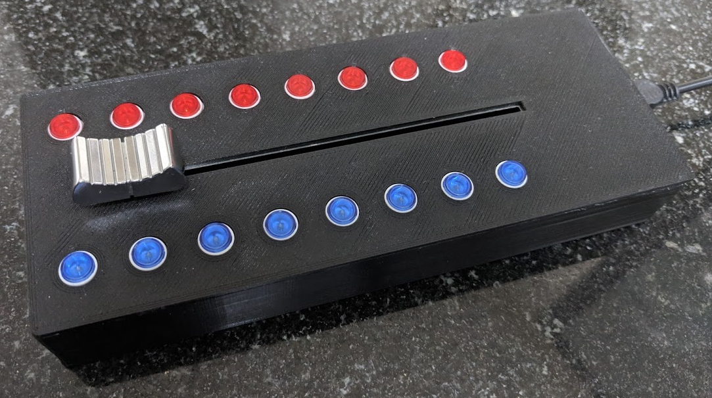
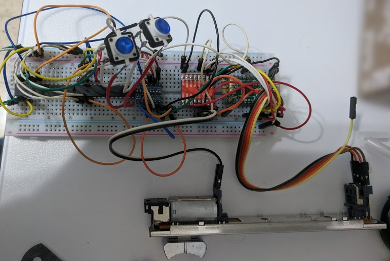
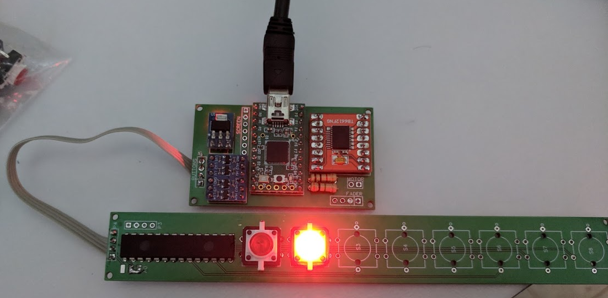
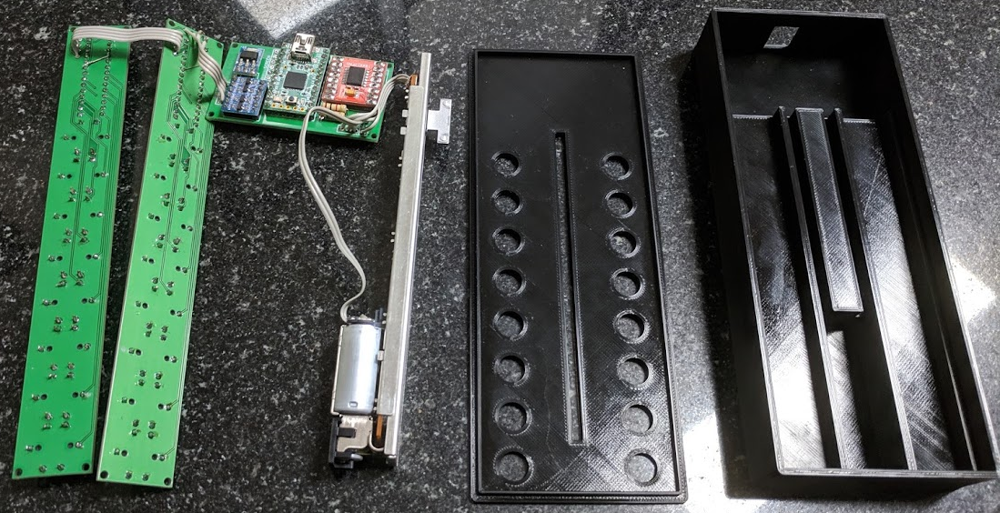
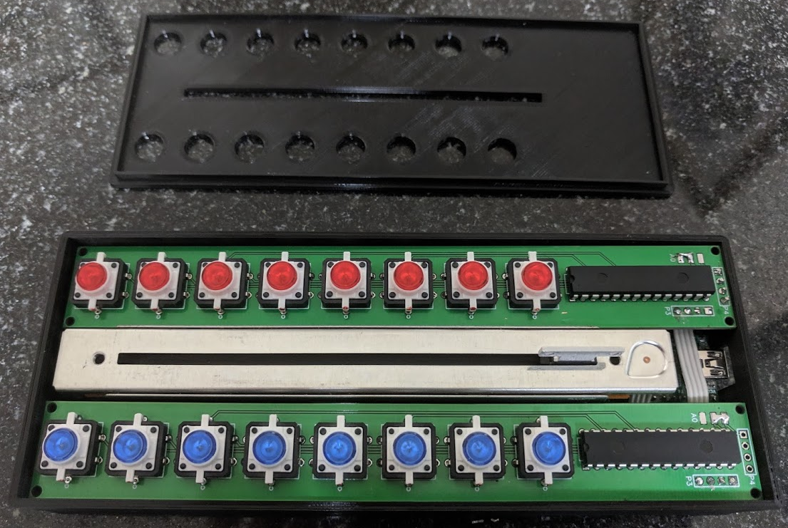

Motorized Fader
===============

About
-----
This is a home made USB MIDI controller with a motorized fader.
It has only one physical fader, but it simulates 8 (virtual faders) with only one active at a time. Active fader is selected using the red buttons.
In addition, there are 8 general purpose CC buttons with blue LEDs.

Behaviour
---------
The host receives a different CC per virtual fader and per blue button. It can change the virtual fader placement and blue button light by sending the same CC back, with a different value.

The active virtual fader is attached to the physical fader and can move it, unless the handle is touched (capacitive sensor). A touch overrides the fader location given by the host.

Clicking an already selected red button will disable/enable all of the contoller LEDs.

Components
----------
- Fader: [ALPS RSA0N11M9A0J](https://www.alps.com/prod/info/E/HTML/Potentiometer/SlidePotentiometers/RSN1M/RSA0N11M9A0J.html)
- Development board: [Teensy 2.0](https://www.pjrc.com/store/teensy.html)
- TB6612FNG Motor driver
- MCP23017-E/SP I2C GPIO expander
- Logic level converter
- 5v to 3v converter
- [Micro switch with LED](https://www.aliexpress.com/item/Free-shipping-50pcs-lot-size-12X12X7-3-push-button-Led-Tact-Switch-illuminated-switch/1428645429.html?spm=a2g0s.9042311.0.0.366c4c4dAUs27O)
- Resistors: 1kΩ, 3MΩ
- [PCB Schematics and full component list](https://easyeda.com/4stamz/Motorized-Fader)
- [3D models of the enclosure, PCBs and other components](https://cad.onshape.com/documents/8fca3ece89a1a691dc7b2f03/w/1110b660203dcd02d4d1f164/e/c94212ecd41983e09bee9d12)

Software
--------
- Developed in C++ with PlatformIO and the Arduino framework.
- In addition, there is a (JavaScript) plugin for Bitwig Studio.

Work in progress
----------------
The first working prototype:

The same prototype with a custom made PCB:

Partial assembly:

